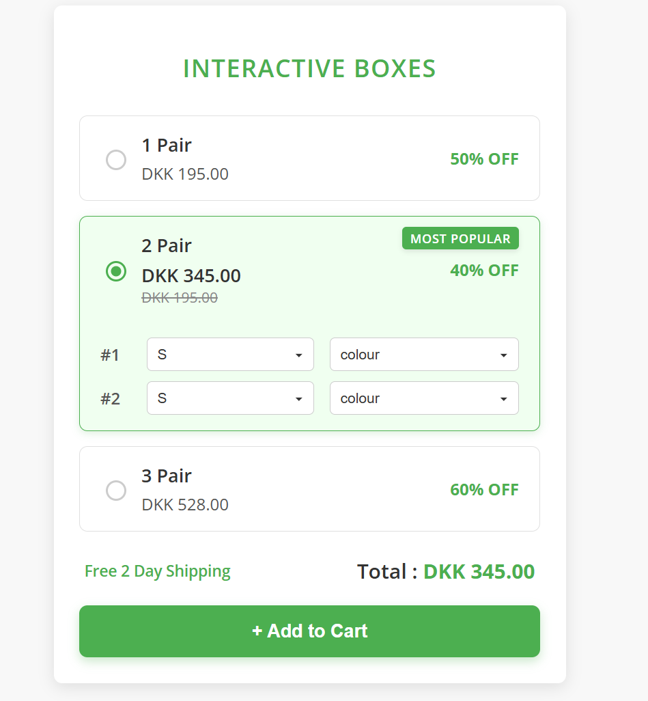

# Interactive Boxes (Bundle & Save Product Selector)



## 📝 Description

This project features an interactive "Bundle & Save" product selection interface, common in e-commerce websites. It allows users to choose from different product bundles (e.g., 1 Pair, 2 Pair, 3 Pair), view details, select options like size and color for individual items within a bundle, and see a dynamically updated total price. The UI is designed to be user-friendly and responsive.

## ✨ Features

* **Multiple Bundle Options:** Users can select different quantity bundles (e.g., 1, 2, or 3 pairs).
* **Interactive Selection:** Clicking on a bundle option highlights it and expands/collapses its detailed selection area.
* **"Most Popular" Badge:** A visually distinct badge highlights a recommended bundle option.
* **Dynamic Price Update:** The total price automatically updates based on the selected bundle.
* **Item Customization:** For multi-item bundles, users can select individual sizes and colors via dropdowns.
* **Responsive Design:** The layout adjusts to provide an optimal viewing experience on various screen sizes (desktop and mobile).
* **"Add to Cart" Action:** A functional button demonstrates adding the selected bundle and its customizations to a "cart" (currently logs data to console and shows an alert).
* **Custom Radio Buttons:** Stylish custom-designed radio buttons enhance the UI.

## 🚀 Technologies Used

* **HTML:** For the fundamental structure of the web page.
* **CSS:**
    * **CSS Variables (`:root`):** For easy theme management and consistent styling.
    * **Flexbox:** For efficient and responsive layout design, especially for aligning items in rows.
    * **Media Queries:** To ensure the layout adapts beautifully to different screen sizes.
* **JavaScript (ES6+):** For interactive elements, dynamic content updates, and event handling.
* **Google Fonts:** Specifically `Open Sans` for typography.
* **SVG:** Used for the favicon and custom dropdown arrows.

## 📦 Setup and Installation

To get a local copy up and running, follow these simple steps.

1.  **Clone the repository:**
    ```bash
    git clone <https://github.com/Hassanmufezshaikh/InteractiveBoxes.git>
    ```
2.  **Open in Browser:**
    Simply open the `index.html` file in your preferred web browser. All necessary CSS and JavaScript files are linked locally.

    ```bash
    # From your project root directory:
    open index.html  # On macOS
    start index.html # On Windows
    xdg-open index.html # On Linux
    ```

## 💡 Usage

* **Select a Bundle:** Click anywhere on the header of a bundle option (e.g., "1 Pair", "2 Pair", "3 Pair") or directly on the radio button to select it.
* **Customize Items:** If you select the "2 Pair" bundle, the content area will expand, revealing dropdowns for selecting size and color for each item. Make your choices here.
* **View Total:** The "Total" price at the bottom will automatically update to reflect the price of your selected bundle.
* **Add to Cart:** Click the "+ Add to Cart" button. This will trigger a console log of the selected bundle's data and a confirmation alert.

## 📂 File Structure